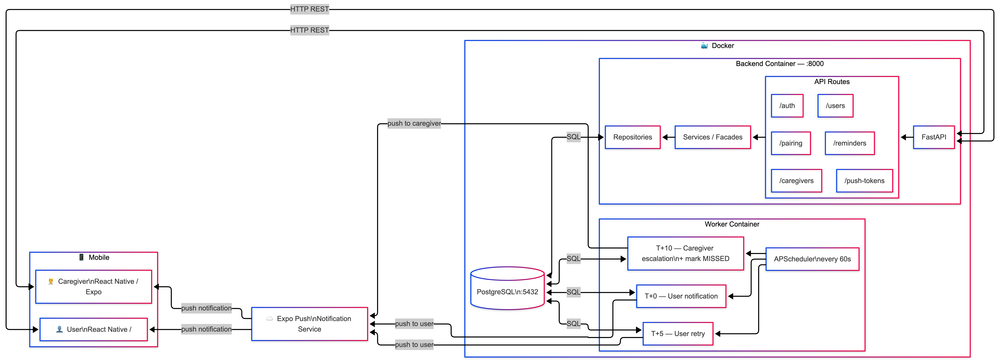

# Mnesya

Mobile reminder application for elderly people and their caregivers.

## Table of Contents

- [About](#about)
- [Features](#features)
- [Architecture](#architecture)
- [Application Diagram](#application-diagram)
- [Database Schema](#database-schema)
- [Technologies](#technologies)
- [Installation](#installation)
- [Project Structure](#project-structure)
- [API Documentation](#api-documentation)
- [Development](#development)
- [Tests](#tests)

## About

Mnesya is a mobile reminder application designed to help elderly people (Users) and their caregivers, with a focus on simple and accessible use.

### Main Users

- **User (Elderly Person)**: Receives and responds to reminders
- **Caregiver**: Configures and manages profiles and reminders

### MVP Guiding Principles

- Ultra-simple interface for elderly people
- Large clickable areas and readable text (minimum 16px)
- Maximum 3 buttons per screen
- Linear journey without complex navigation

### MVP Scope - Current Implementation (Mar 2, 2026)

- **12 screens implemented**:
  - 1 Shared screen: WelcomeScreen
  - 8 Caregiver screens: LoginScreen, RegisterScreen, DashboardScreen, CaregiverProfileScreen, CreateProfileScreen, CreateReminderScreen, RemindersListScreen, UserProfileDetailScreen
  - 3 User screens: UserPairingScreen, UserHomeScreen, ReminderNotificationScreen
- **Internationalization**: Full bilingual support (FR/EN) with i18next
- **Enhanced Notifications**: Backend scheduler with 3 jobs (T+0, T+5, T+10 min) + automatic caregiver alerts
- **API Integration**: Frontend fully connected to backend (auth, profiles, pairing, reminders, reminder status)
- **Code Quality**: ESLint v9 configured (0 errors, 0 warnings across all frontend files)
- **Current status**: Frontend 100% connected, Backend 100% (auth, profiles, pairing, reminders, reminder status all live)
- **Detailed User Stories**: See [Technical Documentation \_ Mnesya.pdf](docs/Technical%20Documentation%20_%20Mnesya.pdf) (MoSCoW method, US-001 to US-027)

## Features

### Authentication (Caregiver)

- ✅ Caregiver account creation (email/password) - Fully integrated (frontend + backend)
- ✅ Secure JWT login - Fully integrated (frontend + backend)
- ✅ Token storage and management (tokenService with AsyncStorage)
- ✅ Automatic logout on token expiry

### Profile Management (Caregiver)

- ✅ User profile creation (first name, last name, date of birth, optional photo) - Fully integrated
- ✅ View and edit all managed profiles - Fully integrated
- ✅ Edit caregiver's own profile - Implemented (CaregiverProfileScreen)
- ✅ Pairing code generation (6 characters, valid 24h) - Fully integrated (frontend + backend)
- ✅ 6-character code input (react-native-confirmation-code-field)
- ✅ Bilingual interface (French/English) with i18next

### Reminder Management (Caregiver)

- ✅ Simple reminder creation (title, message, date, time) - Fully integrated (frontend + backend)
- ✅ Chronological reminder view with filters (date, profile, status) - Fully integrated
- ✅ Status tracking (Done, Pending, Postponed, Unable) - Fully integrated
- ✅ Tab navigation (Home | Reminders | Profile) - Implemented

### User Interface (Elderly Person)

- ✅ Pairing via 6-character code - Fully integrated (frontend + backend)
- ✅ Simple home screen with profiles and next reminder - Integrated with real API data
- ✅ Full-screen notification at reminder time - Implemented with Expo Notifications
  - Enhanced notification system (backend APScheduler + Expo Push):
  - 3 automatic repetitions (immediate T+0, retry T+5 min, escalation T+10 min)
  - Automatic caregiver alert if no response after 10 minutes
  - Smart notification cancellation when user responds
  - Badge count management on app icon
- 3 available actions:
  - Done (Green, #4CAF50) - Cancels all remaining notifications
  - Remind me later (Orange, #FF9800) - Triggers next repetition
  - Unable (Red, #F44336) - Sends immediate alert to caregiver
- ✅ Bilingual notifications (French/English)

## Architecture

### Application Diagram



### Database Schema


### Main Data Flows (Current Implementation)

1. ✅ **Caregiver Registration/Login**: Frontend → FastAPI (JWT) → PostgreSQL
   - Frontend: Fully integrated with authService + tokenService
   - Backend: `/api/auth/register` and `/api/auth/login` endpoints live

2. ✅ **Profile Management**: Frontend → FastAPI → PostgreSQL
   - Frontend: Integrated with real API via profileService
   - Backend: `/api/users` CRUD implemented

3. ✅ **User Pairing**: Frontend (Code entry) → FastAPI (Validation/expiration) → PostgreSQL
   - Frontend: Fully integrated with pairingService
   - Backend: `/api/pairing` generate and verify endpoints live

4. ✅ **Reminder Management**: Caregiver creates/edits/deletes reminders → Frontend → FastAPI → PostgreSQL
   - Frontend: Integrated with real API via reminderService
   - Backend: `/api/reminders` full CRUD implemented

5. ✅ **Status Update**: User responds → Frontend → FastAPI → PostgreSQL + notification cancellation
   - Frontend: Integrated with useReminderStatus hook
   - Backend: `/api/reminders/{id}/status` endpoint live

## Technologies

### Frontend

- **Framework** : React Native 0.81.5 with Expo 54 (iOS/Android)
- **Language**: TypeScript 5.9
- **State Management** : React Hooks + AsyncStorage
- **Navigation** : React Navigation 7 (Stack + Bottom Tabs)
- **Internationalization**: i18next + react-i18next (FR/EN)
- **Notifications** : Expo Notifications (local scheduling with 4 automatic repetitions + caregiver alerts)
- **Code Quality**: ESLint v9 (flat config) with @typescript-eslint, eslint-plugin-react, eslint-plugin-react-hooks
- **UI Components**:
  - Custom date/time pickers (cross-platform)
  - Haptic feedback (expo-haptics)
  - 6-character code input (react-native-confirmation-code-field)
  - PIN view (react-native-pin-view)

### Backend - Fully Implemented

- **Framework** : Python 3.9+ with FastAPI 0.104.1
- **Database** : PostgreSQL 13+ with psycopg2-binary
- **ORM** : SQLAlchemy 2.0.23 with Alembic 1.12.1 (2 migrations)
- **Authentication** : JWT with python-jose — implemented
- **Async Tasks** : APScheduler 3.10.4 (3 background jobs every 60s)
  - **Push Notifications** : Expo Push Service (fully integrated)
- **Current Implementation Status**:
  - ✅ SQLAlchemy Models (Caregiver, User, Reminder, ReminderStatus, PushToken, PairingCode)
  - ✅ Persistence Repositories (BaseRepository + 6 domain-specific)
  - ✅ Service Facades (caregiver, user, reminder, reminder_status, notification)
  - ✅ Pydantic Schemas (caregiver, user, reminder, reminder_status, push_token, authentication, pairing_code)
  - ✅ FastAPI app with health endpoint
  - ✅ JWT Authentication (`/api/auth/register`, `/api/auth/login`)
  - ✅ User profile CRUD (`/api/users`)
  - ✅ Caregiver profile management (`/api/caregivers`)
  - ✅ Pairing code generate + verify (`/api/pairing`)
  - ✅ Alembic migrations configured and applied (3 migrations)
  - ✅ Docker Compose full setup (PostgreSQL + Backend + Worker)
  - ✅ pytest test suite (authentication, pairing, user, caregiver, reminder, reminder_status, push_notification)
  - ✅ Reminder API endpoints (`/api/reminders`) — full CRUD
  - ✅ Reminder status update endpoint (`/api/reminders/{id}/status`)
  - ✅ Push token registration (`/api/push-tokens`) — register, unregister, list
  - ✅ APScheduler Worker — 3 jobs: T+0 user notification, T+5 retry, T+10 caregiver escalation

### Infrastructure

- ✅ **Containerisation** : Docker & Docker Compose (fully configured with PostgreSQL, Backend, Worker services)
- ⚠️ **CI/CD** : Not yet configured
- ⚠️ **Environments** : Dev, Staging, Production (to be configured)

## Installation

### Current Status (Mar 2, 2026)

**Frontend**: Fully operational — connected to real backend (auth, profiles, pairing, reminders, reminder status)  
**Backend**: Fully operational — all MVP endpoints live  
**Docker**: Fully configured with PostgreSQL, Backend, and Worker services

### Prerequisites

- Node.js 16+ and npm/yarn
- Python 3.9+ (if manual installation)
- PostgreSQL 13+ (if manual installation)
- Docker and Docker Compose (recommended)

### Installation with Docker (Recommended)

```bash
# Clone the repository
git clone <repository-url>
cd mnesya

# Start the full environment (PostgreSQL + Backend + Worker)
cd docker
docker-compose up -d

# Check services status
docker-compose ps

# View logs
docker-compose logs -f backend
```

The backend will be available at `http://localhost:8000`  
Health endpoint: `http://localhost:8000/health`

### Manual Installation

#### Backend Setup

```bash
cd backend

# Create a virtual environment
python -m venv venv
source venv/bin/activate  # Linux/Mac
# or
venv\Scripts\activate  # Windows

# Install dependencies
pip install -r requirements.txt

# Configure environment variables
# Create a .env file at the root of /backend with the required variables
# (DATABASE_URL, SECRET_KEY)

# Initialize the database
alembic upgrade head

# Start the server
uvicorn app.main:app --reload
```

#### Frontend Setup

```bash
cd frontend

# Install dependencies
npm install

# Start Expo development server
npm start

# Run on iOS (Mac only)
npm run ios

# Run on Android
npm run android
```

## Project Structure

```text
mnesya/
├── backend/                    # Backend API Python/FastAPI
│   ├── app/
│   │   ├── main.py            # FastAPI application entry point
│   │   ├── config.py          # Database and app configuration
│   │   ├── __init__.py        # App factory and database initialization
│   │   ├── api/               # Route handlers
│   │   │   ├── authentication.py      # /api/auth (register, login, JWT)
│   │   │   ├── caregiver.py           # /api/caregivers (profile management)
│   │   │   ├── user.py                # /api/users (profile CRUD)
│   │   │   ├── pairing.py             # /api/pairing (generate + verify)
│   │   │   ├── reminder.py            # /api/reminders (full CRUD)
│   │   │   ├── reminder_status_api.py # /api/reminders/{id}/status
│   │   │   └── push_notification.py   # /api/push-tokens (register, unregister, list)
│   │   ├── models/            # SQLAlchemy ORM models
│   │   │   ├── caregiver.py
│   │   │   ├── user.py
│   │   │   ├── reminder.py
│   │   │   ├── reminder_status.py
│   │   │   ├── reminder_status_enum.py
│   │   │   ├── push_token.py
│   │   │   └── pairing_code.py
│   │   ├── persistence/       # Repository pattern (data access layer)
│   │   │   ├── base_repository.py
│   │   │   ├── caregiver_repository.py
│   │   │   ├── user_repository.py
│   │   │   ├── pairing_code_repository.py
│   │   │   ├── reminder_repository.py
│   │   │   ├── reminder_status_repository.py
│   │   │   └── push_token_repository.py
│   │   ├── services/          # Business logic (facade pattern)
│   │   │   ├── caregiver_facade.py
│   │   │   ├── user_facade.py
│   │   │   ├── reminder_facade.py
│   │   │   ├── reminder_status_facade.py
│   │   │   └── notification_services.py  # Expo Push SDK integration
│   │   ├── schemas/           # Pydantic validation schemas
│   │   │   ├── authentication_schema.py
│   │   │   ├── caregiver_schema.py
│   │   │   ├── user_schema.py
│   │   │   ├── pairing_code_schema.py
│   │   │   ├── reminder_schema.py
│   │   │   ├── reminder_status_schema.py
│   │   │   └── push_token_schema.py
│   │   └── test/              # pytest test suite
│   │       ├── test_authentication_api.py
│   │       ├── test_caregiver_api.py
│   │       ├── test_pairing_api.py
│   │       ├── test_user_api.py
│   │       ├── test_reminder_api.py
│   │       ├── test_reminder_status_api.py
│   │       └── test_push_notification_api.py
│   ├── worker/                # APScheduler background jobs
│   │   └── scheduler.py       # 3 jobs: T+0 notify, T+5 retry, T+10 escalate
│   ├── alembic/               # Database migrations
│   │   └── versions/          # 3 migrations
│   ├── alembic.ini
│   ├── requirements.txt
│   └── pytest.ini
├── frontend/                  # React Native + Expo + TypeScript Mobile App
│   ├── src/
│   │   ├── App.tsx            # Root component with i18n + context
│   │   ├── i18n.ts            # i18next configuration (FR/EN)
│   │   ├── components/        # Reusable UI components
│   │   │   ├── ChangePasswordModal.tsx
│   │   │   ├── ConfirmationModal.tsx
│   │   │   ├── FilterPickerModal.tsx
│   │   │   ├── PairingCodeModal.tsx
│   │   │   ├── PlatformDatePicker.tsx
│   │   │   ├── PlatformTimePicker.tsx
│   │   │   ├── ReminderCard.tsx
│   │   │   ├── UpdateUserProfileModal.tsx
│   │   │   └── UpdateCaregiverProfileModal.tsx
│   │   ├── contexts/          # React contexts
│   │   │   └── RefreshContext.tsx  # Global refresh trigger
│   │   ├── hooks/             # Custom React hooks
│   │   │   ├── useAuth.ts          # Auth state (login/logout/register)
│   │   │   ├── useFormValidation.ts        # Form validation logic
│   │   │   ├── useCaregiverProfile.ts
│   │   │   ├── useUserProfile.ts
│   │   │   ├── useUserProfiles.ts
│   │   │   ├── useUserReminders.ts         # Reminders list for users
│   │   │   ├── useCaregiverReminders.ts    # Reminders with caregiver context
│   │   │   └── useReminderStatus.ts        # Reminder status updates
│   │   ├── locales/           # i18n translation files
│   │   │   ├── en.json
│   │   │   └── fr.json
│   │   ├── navigation/
│   │   │   ├── AppNavigator.tsx    # Main stack navigator
│   │   │   ├── CaregiverTabs.tsx   # Bottom tabs (Home | Reminders | Profile)
│   │   │   └── UserTabs.tsx        # Bottom tabs (Home | Profile)
│   │   ├── screens/           # 12 application screens
│   │   │   ├── WelcomeScreen.tsx
│   │   │   ├── LoginScreen.tsx
│   │   │   ├── RegisterScreen.tsx
│   │   │   ├── DashboardScreen.tsx
│   │   │   ├── CaregiverProfileScreen.tsx
│   │   │   ├── CreateProfileScreen.tsx
│   │   │   ├── CreateReminderScreen.tsx
│   │   │   ├── RemindersListScreen.tsx
│   │   │   ├── UserProfileDetailScreen.tsx
│   │   │   ├── UserPairingScreen.tsx
│   │   │   ├── UserHomeScreen.tsx
│   │   │   └── ReminderNotificationScreen.tsx
│   │   ├── services/          # API service layer
│   │   │   ├── api.ts              # Axios client with JWT interceptors
│   │   │   ├── authService.ts      # register, login (JWT)
│   │   │   ├── tokenService.ts     # JWT storage + retrieval
│   │   │   ├── profileService.ts   # Profile CRUD
│   │   │   ├── reminderService.ts  # Reminder CRUD
│   │   │   └── pairingService.ts   # Pairing code generate + verify
│   │   ├── styles/
│   │   │   └── commonStyles.ts     # Shared style definitions
│   │   ├── types/
│   │   │   ├── index.ts
│   │   │   ├── interfaces.ts
│   │   │   └── declaration.d.ts
│   │   ├── config/
│   │   │   └── api.ts              # Base API URL (auto-detects local IP in dev)
│   │   ├── utils/
│   │   │   ├── animations.ts       # Bell swing + pulse animations
│   │   │   ├── dateUtils.ts        # Age calculation from birthday
│   │   │   ├── notifications.ts    # Expo Notifications setup + repetitions
│   │   │   └── validation.ts       # Form field validation functions
│   │   └── data/
│   │       └── fakeData.ts         # Mock data for local testing
│   ├── assets/
│   ├── archives/              # Archived legacy components
│   ├── app.json
│   ├── babel.config.js
│   ├── jest.config.js
│   ├── jest.setup.js
│   ├── tsconfig.json   ├── eslint.config.js│   ├── index.tsx
│   └── package.json
├── docker/                    # Docker configuration
│   ├── docker-compose.yml     # PostgreSQL + Backend + Worker services
│   └── README.md
├── docs/                      # Documentation
│   ├── Technical Documentation _ Mnesya.pdf
│   ├── Project Planning.pdf
│   ├── Team Formation and Idea Development Outline.pdf
│   ├── bug-report.md          # Bug tracking and solutions
│   ├── unit-testing-journey.md
│   ├── test-warnings-resolution.md
│   ├── trello-status.md
│   └── img/
├── README.md
└── .gitignore
```

## API Documentation

> Base URL: `http://localhost:8000`  
> Interactive docs: `http://localhost:8000/docs` (Swagger UI)

### Authentication

| Endpoint             | Method | Description            | Auth |
| -------------------- | ------ | ---------------------- | ---- |
| `/api/auth/register` | POST   | Caregiver registration | No   |
| `/api/auth/login`    | POST   | Login (returns JWT)    | No   |
| `/api/auth/me`       | GET    | Get current caregiver  | Yes  |

### Caregiver Profile

| Endpoint               | Method | Description              | Auth            |
| ---------------------- | ------ | ------------------------ | --------------- |
| `/api/caregivers/{id}` | GET    | Get caregiver profile    | Yes (Caregiver) |
| `/api/caregivers/{id}` | PUT    | Update caregiver profile | Yes (Caregiver) |

### User Profiles (Elderly)

| Endpoint          | Method | Description           | Auth            |
| ----------------- | ------ | --------------------- | --------------- |
| `/api/users`      | POST   | Create a user profile | Yes (Caregiver) |
| `/api/users`      | GET    | List all profiles     | Yes (Caregiver) |
| `/api/users/{id}` | GET    | Get a profile         | Yes (Caregiver) |
| `/api/users/{id}` | PUT    | Update a profile      | Yes (Caregiver) |
| `/api/users/{id}` | DELETE | Delete a profile      | Yes (Caregiver) |

### Pairing

| Endpoint                | Method | Description                      | Auth            |
| ----------------------- | ------ | -------------------------------- | --------------- |
| `/api/pairing/generate` | POST   | Generate 6-char code (24h valid) | Yes (Caregiver) |
| `/api/pairing/verify`   | POST   | Verify code and receive JWT      | No              |

### Reminders

| Endpoint                     | Method | Description       | Auth            |
| ---------------------------- | ------ | ----------------- | --------------- |
| `/api/reminders`             | POST   | Create a reminder | Yes (Caregiver) |
| `/api/reminders`             | GET    | List reminders    | Yes (Caregiver) |
| `/api/reminders/{id}`        | PUT    | Update a reminder | Yes (Caregiver) |
| `/api/reminders/{id}`        | DELETE | Delete a reminder | Yes (Caregiver) |
| `/api/reminders/{id}/status` | PUT    | Update status     | Yes (User)      |

### Push Notifications

| Endpoint                      | Method | Description                | Auth                    |
| ----------------------------- | ------ | -------------------------- | ----------------------- |
| `/api/push-tokens/register`   | POST   | Register device push token | Yes (Caregiver or User) |
| `/api/push-tokens/unregister` | DELETE | Remove device push token   | Yes (Caregiver or User) |
| `/api/push-tokens/my-tokens`  | GET    | List my registered tokens  | Yes (Caregiver or User) |

### Request Examples

#### Caregiver Registration

```json
POST /api/auth/register
{
  "email": "caregiver@example.com",
  "password": "SecurePass123",
  "first_name": "John",
  "last_name": "Doe"
}
```

#### Generate Pairing Code

```json
POST /api/pairing/generate
Authorization: Bearer <caregiver_token>
{
  "user_id": "uuid-of-profile"
}
```

#### Verify Pairing Code (User login)

```json
POST /api/pairing/verify
{
  "code": "ABC123"
}
```

#### Reminder Creation

```json
POST /api/reminders
Authorization: Bearer <caregiver_token>
{
  "user_id": "uuid-of-profile",
  "title": "Take medications",
  "description": "Don't forget to take morning medications",
  "scheduled_at": "2026-02-20T09:00:00"
}
```

**Possible reminder statuses**:

- `Done`: Task completed
- `Pending`: Reminder not yet processed
- `Postponed`: Reminder snoozed
- `Unable`: Task impossible, alert caregiver

## Development

### Git Branching Strategy

The project uses a simplified Gitflow workflow:

- **main**: Stable branch, reflects production code
- **dev**: Main integration branch
- **front/feat/\***: Frontend feature branches (e.g., `front/feat/auth-integration`)
- **back/feat/\***: Backend feature branches (e.g., `back/feat/api-authentication`)

### Workflow

1. Create a `front/feat/*` or `back/feat/*` branch from `dev`
2. Develop and commit
3. Create a Pull Request to `dev`
4. Code review by the other developer
5. Merge into `dev`
6. Once validated, PR from `dev` to `main`

### Commit Conventions

```text
feat(api): add POST /reminders endpoint
fix(frontend): resolve navigation issue
docs: update README
```

### Design System

#### Typography

- **Headings (H1)**: 24px, Bold
- **Body text**: 16px minimum, Regular
- **Buttons**: 18px, Medium

#### Spacing

- Minimum button height: **56px**
- Minimum clickable areas: 44x44px

#### Color Palette

- **Primary Blue**: #4A90E2 (navigation, main actions)
- **Success Green**: #4CAF50 (Done button)
- **Warning Orange**: #FF9800 (Remind later button)
- **Error Red**: #F44336 (Unable button)
- High contrast for accessibility (WCAG AA)

#### UX Constraints

- Maximum 3 buttons per screen
- Linear journey without complex navigation

## Tests

### Backend (Python/FastAPI)

```bash
cd backend

# Run all tests
pytest app/test/

# With coverage
pytest app/test/ --cov=app
```

#### Backend Test Files

- `test_authentication_api.py` — Register, login, token validation
- `test_caregiver_api.py` — Caregiver profile CRUD
- `test_pairing_api.py` — Generate and verify pairing codes
- `test_user_api.py` — User profile CRUD
- `test_reminder_api.py` — Reminder CRUD endpoints
- `test_reminder_status_api.py` — Reminder status update endpoint
- `test_push_notification_api.py` — Push token register, unregister, list
- **Tool**: pytest + SQLAlchemy test database

### Frontend (React Native + Jest)

```bash
cd frontend

# Run all tests
npm test

# With coverage report
npm test -- --coverage
```

#### Frontend Test Files (163 tests across 14 suites)

- `services/__tests__/authService.test.ts` — register, login API calls
- `services/__tests__/tokenService.test.ts` — JWT storage and retrieval
- `services/__tests__/reminderService.test.ts` — Reminder CRUD API calls
- `services/__tests__/pairingService.test.ts` — Pairing code generate and verify
- `services/__tests__/profileService.test.ts` — User profile CRUD API calls
- `hooks/__tests__/useCaregiverProfile.test.ts` — Hook loading/error/reload behaviour
- `hooks/__tests__/useUserProfile.test.ts` — User profile hook behaviour
- `hooks/__tests__/useUserProfiles.test.ts` — Profiles list hook behaviour
- `hooks/__tests__/useUserReminders.test.ts` — Reminders list hook behaviour
- `hooks/__tests__/useCaregiverReminders.test.ts` — Caregiver reminders hook behaviour
- `hooks/__tests__/useReminderStatus.test.ts` — Reminder status hook behaviour
- `components/__tests__/UpdateUserProfileModal.test.tsx` — Modal rendering and validation
- `components/__tests__/UpdateCaregiverProfileModal.test.tsx` — Modal rendering and validation
- `utils/__tests__/validation.test.ts` — Form validation utility functions
- **Tools**: Jest + React Native Testing Library + ESLint v9

### Manual Tests

Acceptance criteria checklist to verify before each Production deployment:

#### Functional

- [ ] A caregiver can create an account and log in
- [ ] A caregiver can create and edit a user profile
- [ ] A caregiver can generate a 24h valid pairing code
- [ ] A user can pair with the code and receive a JWT
- [ ] A caregiver can create a one-shot reminder
- [ ] A user receives a full-screen notification at reminder time
- [ ] A user can respond Done/Remind Later/Unable
- [ ] "Remind later" triggers a new local notification
- [ ] "Unable" sends an immediate alert to the caregiver

#### Design

- [ ] All texts are readable (minimum 16px)
- [ ] All buttons respect 56px minimum height
- [ ] Maximum 3 actions per screen
- [ ] Clear and linear navigation
- [ ] Contrasted colors (WCAG AA accessibility test)

#### Technical

- [ ] JWT token is stored and restored correctly across sessions
- [ ] Pairing code expires after 24h (backend enforcement)
- [ ] Notifications work when the app is in the background
- [ ] API errors are displayed gracefully (no crashes)

### CI/CD

⚠️ Not yet configured — planned for future sprints:

1. **On PR**: Run automated tests (backend pytest + frontend Jest)
2. **Staging Deployment**: Auto-deploy `dev` branch if tests pass
3. **Production Deployment**: Manual deploy from `main` after validation

## MVP Exclusions

Features **not included** in v1.0 (postponed post-MVP):

- ❌ Recurring reminders (daily, weekly, monthly)
- ❌ Graphical calendar view
- ❌ Statistics and graphs
- ❌ Voice messages in reminders
- ❌ Home screen widget
- ❌ Emergency button
- ❌ Advanced settings (custom notification sounds, vibrations, etc.)
- ❌ Images in reminders

These features are documented in the User Stories (US-020 to US-028) as **WON'T HAVE** for the MVP.

---

Developed to make life easier for elderly people and their caregivers.
